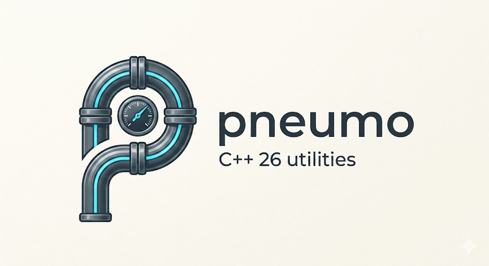

<p align="center">
  
</p>

<h1 align="center">pneumo</h1>
<p align="center">
  <strong>High-pressure utilities for modern C++.</strong>
</p>

<p align="center">
  <a href="LICENSE"></a>
  <a href="https://en.cppreference.com/w/cpp/26"></a>
  <br />
  <a href="https://github.com/daleondev/pneumo/actions"></a>
</p>

<hr />

# Pneumo

**pneumo** is a header-only C++26 utility library with five module targets and one umbrella target:

*   **`pneumo::common`** for shared result, assertion, memory, queue, and bit helpers.
*   **`pneumo::meta`** for compile-time reflection and metaprogramming utilities built on C++26 static reflection.
*   **`pneumo::formatting`** for reflection-aware std::format extensions.
*   **`pneumo::units`** for strongly typed quantities, literals, conversions, and dimensional operations.
*   **`pneumo::logging`** for asynchronous structured logging, configurable routing, source metadata, files, and custom sinks.

`pneumo::pneumo` links all five modules, and `pneumo/pneumo.hpp` is the matching umbrella header.

## Module Overview

### `pneumo::common`

The common module contains small reusable helpers that support the higher-level libraries:

*   `pnm::Result<T>` as `std::expected<T, std::error_code>`.
*   `pnm::utils::memory` byte-copy helpers for trivially copyable values and contiguous ranges.
*   `pnm::utils::concurrent` thread concepts plus thread start/stop helpers.
*   `pnm::utils::queue` push/pop adapters for queue-like types, optionally guarded by a lock.
*   `pnm::utils::bit` constexpr unsigned bit masks and masked get/set helpers.
*   Debug assertions and portable structure-packing macros.

### `pneumo::meta`

The meta module provides:

*   **Tuple utilities:** Concepts, type transforms, index iteration, and element iteration for `std::tuple`.
*   **Variant utilities:** Concepts, tuple conversion, unique type reduction, reference-wrapper adaptation, and index iteration for `std::variant`.
*   **Type utilities:** Type and namespace name discovery.
*   **Enum reflection:** Scoped-enum counting, names, enumerators, and underlying values.
*   **Structural reflection:** Public fields, nested types, methods, getter discovery, indexed invocation, and name-based static dispatch.
*   **Source access:** Embed translation units, lazily load source files, cache them safely, and render numbered excerpts.

### `pneumo::formatting`

Pneumo extends `std::format` with automatic reflection-aware formatting while preserving standard formatter ergonomics.

Key features include:

*   **Automatic reflection:** Format public aggregates without writing boilerplate.
*   **Non-intrusive adapters:** Format classes with private members or custom layouts through `pnm::fmt::Adapter`.
*   **Enum support:** Format scoped enums by name, with an optional verbose `Type::Enumerator` form.
*   **Pointer and optional support:** Built-in handling for raw pointers, smart pointers, and `std::optional`.
*   **Stream and string fallbacks:** Support `operator<<`, `toString()`, `to_string()`, and matching free functions when no adapter is present.
*   **Optional serialization:** JSON and TOML output via [Glaze](https://github.com/stephenberry/glaze) when enabled; YAML output is available when Glaze metadata exists for the formatted type.

### `pneumo::units`

The units module provides strongly typed quantities backed by base units plus user-defined literals, conversions, and constrained arithmetic.

The current built-in quantity types are:

*   `Distance`
*   `Area`
*   `Time`
*   `ByteSize`
*   `Mass`
*   `Temperature`
*   `Current`
*   `Voltage`
*   `Force`
*   `Energy`
*   `Power`
*   `Pressure`
*   `Frequency`
*   `DataRate`
*   `Velocity`
*   `Acceleration`
*   `Angle`

The current built-in cross-quantity operations include:

*   `Distance * Distance -> Area`
*   `Area / Distance -> Distance`
*   `Distance / Time -> Velocity`
*   `Distance / Velocity -> Time`
*   `Velocity / Time -> Acceleration`
*   `Velocity / Acceleration -> Time`
*   `Mass * Acceleration -> Force`
*   `Force / Mass -> Acceleration`
*   `Force * Distance -> Energy`
*   `Energy / Force -> Distance`
*   `Energy / Time -> Power`
*   `Energy / Power -> Time`
*   `Force / Area -> Pressure`
*   `Force / Pressure -> Area`
*   `Voltage * Current -> Power`
*   `Power / Voltage -> Current`
*   `Power / Current -> Voltage`
*   `1 / Time -> Frequency`
*   `1 / Frequency -> Time`
*   `Time * Frequency -> double`
*   `ByteSize / Time -> DataRate`
*   `ByteSize / DataRate -> Time`
*   The corresponding inverse multiplications for quotient relations, such as `Time * Velocity`, `Acceleration * Time`, `DataRate * Time`, `Pressure * Area`, and `Time * Power`

Temperature uses Celsius as its base unit and provides affine conversions to Kelvin and Fahrenheit. Angles use radians as their base unit and convert to and from degrees.

### `pneumo::logging`

The logging module provides:

*   `Trace`, `Debug`, `Info`, `Warn`, `Error`, and `Critical` levels with compile-time checked format strings.
*   Asynchronous logging by default and the `pnm::log::immediate` tag for synchronous writes.
*   Built-in stdout, stderr, and cached file sinks. The default route sends `Trace` through `Warn` to stdout and `Error` through `Critical` to stderr.
*   Per-level default sinks, removable global sinks, per-call explicit sinks, minimum levels, and flush thresholds.
*   Optional file name/path, line, column, function, and embedded source excerpts on each sink.
*   Compile-time-checked per-sink timestamp formats and optional level labels.
*   User-defined sinks through `pnm::log::ISink` and `pnm::log::SinkBase`.

### CMake Targets and Headers

| Target | Header(s) | Purpose |
| :--- | :--- | :--- |
| `pneumo::common` | `pneumo/common.hpp` | Shared result, assertion, memory, queue, and bit helpers |
| `pneumo::meta` | `pneumo/meta.hpp` | Reflection and metaprogramming utilities |
| `pneumo::formatting` | `pneumo/formatting.hpp` | Reflection-based formatting and optional serialization |
| `pneumo::units` | `pneumo/units.hpp` | Strong quantity types, literals, conversions, and derived operations |
| `pneumo::logging` | `pneumo/logging.hpp` | Asynchronous logging, routing, metadata, files, and custom sinks |
| `pneumo::pneumo` | `pneumo/pneumo.hpp` | Convenience target and umbrella header for all modules |

## Requirements

*   **`pneumo::common`** uses standard C++26 library facilities and does not depend on static reflection.
*   **`pneumo::meta`**, **`pneumo::formatting`**, **`pneumo::units`**, and **`pneumo::logging`** currently require a compiler/toolchain with C++26 static reflection support.
*   **CMake 4.2.0+**

The checked-in CMake presets in this repository currently target GCC 16 and the Clang P2996 toolchain configured in `CMakePresets.json`.

If you use formatting, units, or logging on a toolchain where `<format>` or `<print>` live in a separate support library, you may also need to link that library explicitly. The sample targets use `stdc++exp` with the supported Linux toolchains.

## Installation

### CMake FetchContent

You can include pneumo in your CMake project with `FetchContent`:

```cmake
include(FetchContent)

FetchContent_Declare(
        pneumo
        GIT_REPOSITORY https://github.com/daleondev/pneumo.git
        GIT_TAG        v0.1.0
)
FetchContent_MakeAvailable(pneumo)

target_link_libraries(your_target PRIVATE pneumo::common)
# or
target_link_libraries(your_target PRIVATE pneumo::meta)
# or
target_link_libraries(your_target PRIVATE pneumo::formatting)
# or
target_link_libraries(your_target PRIVATE pneumo::units)
# or
target_link_libraries(your_target PRIVATE pneumo::logging)
# or
target_link_libraries(your_target PRIVATE pneumo::pneumo)
```

When you want the full library surface, pair `pneumo::pneumo` with:

```cpp
#include <pneumo/pneumo.hpp>
```

You can still include the specific module headers directly when you only want part of the library.

## Common Examples

```cpp
#include <pneumo/common.hpp>

#include <array>
#include <cstddef>
#include <cstdint>
#include <queue>

auto main() -> int
{
    constexpr std::uint32_t source{ 0x1234ABCDU };
    std::array<std::byte, sizeof(source)> bytes{};
    std::uint32_t restored{};

    pnm::utils::memory::copy(bytes, source);
    pnm::utils::memory::copy(restored, bytes);

    auto queue = std::queue<int>{};
    pnm::utils::queue::push(queue, 42);
    const auto value = pnm::utils::queue::pop(queue);

    std::uint8_t flags{};
    pnm::utils::bit::set<0>(flags);
    pnm::utils::bit::set_masked_checked<2, 3>(flags, std::uint8_t{ 0b101 });

    PNM_ASSERT(value.has_value(), "queue unexpectedly empty");
    return restored == source && pnm::utils::bit::check<0>(flags) ? 0 : 1;
}
```

`PNM_ASSERT` is enabled by the `PNM_ENABLE_ASSERTS` definition, which the CMake targets add in Debug configurations. Failed assertions print the expression and source location before breaking into the debugger. `PNM_PACK_BEGIN`, `PNM_PACK_BEGIN_N(n)`, and `PNM_PACK_END` provide portable structure-packing scopes.

## Logging Examples

### Basic routing and metadata

```cpp
#include <pneumo/logging.hpp>

PNM_META_SOURCE_EMBED_CURRENT

auto main() -> int
{
    pnm::log::initialize(); // Optional eager initialization; logging also initializes lazily.

    pnm::log::std_out
      ->sourceInfo(pnm::log::SourceField::FileName, pnm::log::SourceField::Line)
      .timestampFormat("{:%Y-%m-%d %H:%M:%S}");

    pnm::log::std_err
      ->sourceInfo(pnm::log::SourceField::Function)
      .showLevel(false);

    pnm::log::info("Server started on port {}", 8080);
    pnm::log::error("Request {} failed", 17);

    pnm::log::warn(
      pnm::log::file("pneumo.log")
        .mode(pnm::log::FileMode::Append)
        .flushOn(pnm::log::Level::Error)
        .sourceInfo(pnm::log::SourceField::FileName, pnm::log::SourceField::Line)
        .sourceExcerpt(1),
      "Slow response: {} ms",
      250);

    pnm::log::info(pnm::log::immediate, "Written synchronously");
}
```

Normal calls are queued to a background worker. Passing `pnm::log::immediate` performs the write before the call returns. An explicit per-call sink routes only to that sink; otherwise a record is sent to its level’s default sink and every registered global sink. The backend drains queued records and closes cached files during process shutdown.

Default routes can be changed per level or level range:

```cpp
pnm::log::set_default_sink(
  pnm::log::Level::Trace, pnm::log::Level::Warn, pnm::log::std_out);
pnm::log::set_default_sink(
  pnm::log::Level::Error, pnm::log::Level::Critical, pnm::log::std_err);

const auto handle = pnm::log::add_global_sink(
  pnm::log::file("all.log").flushOn(pnm::log::Level::Error));

pnm::log::remove_global_sink(handle);
pnm::log::reset_default_sinks();
```

Source excerpts require the translation unit to be registered with `PNM_META_SOURCE_EMBED_CURRENT`, `PNM_META_SOURCE_EMBED_BEGIN`/`PNM_META_SOURCE_EMBED_END`, or otherwise available to `pnm::meta::source::excerpt` at runtime.

### Custom sinks

Derive from `pnm::log::SinkBase<YourSink>` and implement the transport operations. The logger handles formatting, filtering, source metadata, partial writes, and exception isolation around the sink.

```cpp
#include <pneumo/logging.hpp>

#include <atomic>
#include <cstddef>
#include <memory>
#include <span>

class CountingSink : public pnm::log::SinkBase<CountingSink>
{
  public:
    auto isOpen() const -> bool override { return m_open.load(); }

    auto open() -> pnm::Result<> override
    {
        m_open.store(true);
        return {};
    }

    auto close() -> pnm::Result<> override
    {
        m_open.store(false);
        return {};
    }

    auto write(std::span<const std::byte> data) -> pnm::Result<std::size_t> override
    {
        m_bytes.fetch_add(data.size());
        return data.size();
    }

    auto flush() -> pnm::Result<> override { return {}; }

  private:
    std::atomic_bool m_open{};
    std::atomic_size_t m_bytes{};
};

auto main() -> int
{
    auto sink = std::make_shared<CountingSink>();
    pnm::log::info(sink, "Custom transport message");
}
```

## Formatting Examples

For formatting utilities:

```cpp
#include <pneumo/formatting.hpp>

#include <memory>
#include <optional>
#include <print>
#include <string>
#include <tuple>
#include <vector>
```

### 1. Aggregate Reflection

Public aggregate member names and values are discovered automatically:

```cpp
struct Point
{
    int x;
    int y;
};

struct Config
{
    int id;
    std::string name;
    std::vector<double> values;
    Point resolution;
    bool is_active;
};

int main()
{
    Config cfg{ 101, "SimulationConfig", { 0.5, 1.2, 3.14 }, { 1920, 1080 }, true };

    std::println("{}", cfg);
    // Output: [ Config: { id: 101, name: SimulationConfig, values: [0.5, 1.2, 3.14],
    // resolution: [ Point: { x: 1920, y: 1080 } ], is_active: true } ]

    std::println("{:p}", cfg);
    /* Output:
    Config: {
      id: 101,
      name: SimulationConfig,
      values: [0.5, 1.2, 3.14],
      resolution: {
        x: 1920,
        y: 1080
      },
      is_active: true
    }
    */
}
```

### 2. Adapters (Encapsulated Classes)

For classes with private members or custom layouts, define a `pnm::fmt::Adapter` specialization.

```cpp
class User
{
  public:
    User(std::string name, std::string role)
      : m_name(name)
      , m_role(role)
    {
    }
    const std::string& getName() const { return m_name; }
    const std::string& getRole() const { return m_role; }

  private:
    std::string m_name;
    std::string m_role;
};

template<>
struct pnm::fmt::Adapter<User>
{
    using Fields = std::tuple<pnm::fmt::Field<"name", &User::getName>,
                              pnm::fmt::Field<"role", &User::getRole>>;
};

int main()
{
    User user("Alice", "Admin");

    std::println("{}", user);
    // Output: [ User: { name: Alice, role: Admin } ]
}
```

### 3. Scoped Enums

Scoped enums are automatically formatted by enumerator name, with an optional verbose form.

```cpp
enum class Status
{
    Idle,
    Processing,
    Completed
};

int main()
{
    Status s = Status::Processing;

    std::println("{}", s);
    // Output: Processing

    std::println("{:v}", s);
    // Output: Status::Processing
}
```

### 4. Pointers & Optionals

The formatting module handles `nullptr`, `std::optional`, and smart pointers gracefully.

```cpp
struct Point
{
    int x;
    int y;
};

int main()
{
    std::optional<int> opt_val = 123;
    std::println("{}", opt_val);
    // Output: [ 123 ]

    std::optional<int> empty_opt;
    std::println("{}", empty_opt);
    // Output: [ null ]

    auto ptr = std::make_unique<Point>(10, 20);
    std::println("{}", ptr);
    // Output: [ (0x...) -> [ Point: { x: 10, y: 20 } ] ]
}
```

### 5. Serialization (JSON / TOML / YAML)

If enabled via the `PFMT_ENABLE_JSON`, `PFMT_ENABLE_TOML`, or `PFMT_ENABLE_YAML` CMake options, you can format supported objects directly into serialized strings using Glaze.

**Format Specifiers:**

*   `{:j}` - Compact JSON
*   `{:pj}` - Pretty JSON
*   `{:y}` - YAML when Glaze metadata is available for the type
*   `{:t}` - TOML

```cpp
struct Point
{
    int x;
    int y;
};

struct Config
{
    int id;
    std::string name;
    std::vector<double> values;
    Point resolution;
    bool is_active;
};

int main()
{
    Config cfg{ 101, "SimulationConfig", { 0.5, 1.2, 3.14 }, { 1920, 1080 }, true };

    std::println("{:j}", cfg);
    // JSON output is available when PFMT_ENABLE_JSON is ON.

    std::println("{:pj}", cfg);
    // Pretty JSON output is available when PFMT_ENABLE_JSON is ON.

    std::println("{:t}", cfg);
    // TOML output is available when PFMT_ENABLE_TOML is ON.
}
```

For adapter-backed types, Glaze metadata is generated automatically inside `pneumo/formatting.hpp`. That makes adapters the easiest path when you want reflection-aware formatting plus YAML serialization.

### 6. Custom formatting

Custom formatting can be supplied in several ways:

*   `pnm::fmt::Adapter<T>`
*   `operator<<`
*   `toString()` or `to_string()` members
*   matching `toString(T)` or `to_string(T)` free functions

The current precedence is: `Adapter` > stream insertion > string-conversion hooks > reflection.

```cpp
#include <ostream>

struct Point
{
    int x;
    int y;
};

std::ostream& operator<<(std::ostream& os, const Point& p)
{
    return os << "Resolution is " << p.x << "x" << p.y;
}

struct Config
{
    int id;
    std::string name;
    std::vector<double> values;
    Point resolution;
    bool is_active;

    std::string toString() const
    {
        return "Config with id: " + std::to_string(id) +
            " has " + std::to_string(values.size()) + " values";
    }
};

int main()
{
    Config cfg{ 101, "SimulationConfig", { 0.5, 1.2, 3.14 }, { 1920, 1080 }, true };

    std::println("{}", cfg);
    // Output: Config with id: 101 has 3 values

    std::println("{}", cfg.resolution);
    // Output: Resolution is 1920x1080
}
```

## Units Examples

For units utilities:

```cpp
#include <pneumo/units.hpp>

#include <chrono>
#include <iostream>
#include <type_traits>

using namespace pnm::units::literals;
```

### 1. Literals and Unit Conversion

```cpp
int main()
{
    const auto distance = 3.5_km;

    std::cout << distance.get() << " m\n";
    std::cout << distance.get<pnm::units::DistanceUnits::km>() << " km\n";
    std::cout << distance.get<pnm::units::DistanceUnits::cm>() << " cm\n";
}
```

### 2. Dimensional Arithmetic

```cpp
int main()
{
    const auto trip_distance = 42.0_km;
    const auto trip_time = 35.0_min;
    const auto average_speed = trip_distance / trip_time;

    static_assert(std::same_as<std::remove_cvref_t<decltype(average_speed)>, pnm::units::Velocity>);

    std::cout << average_speed.get<pnm::units::VelocityUnits::km_h>() << " km/h\n";
}
```

### 3. Storage and Throughput

```cpp
int main()
{
    const auto size = 90.0_MB;
    const auto duration = 30.0_s;
    const auto rate = size / duration;

    static_assert(std::same_as<std::remove_cvref_t<decltype(rate)>, pnm::units::DataRate>);

    std::cout << rate.get<pnm::units::DataRateUnits::MB_s>() << " MB/s\n";
}
```

### 4. Acceleration Chain

```cpp
int main()
{
    const auto highway_speed = 100.0_km_h;
    const auto zero_to_hundred = 8.0_s;
    const auto average_acceleration = highway_speed / zero_to_hundred;
    const auto speed_after_three_seconds = average_acceleration * 3.0_s;

    static_assert(std::same_as<std::remove_cvref_t<decltype(average_acceleration)>,
                               pnm::units::Acceleration>);
    static_assert(std::same_as<std::remove_cvref_t<decltype(speed_after_three_seconds)>,
                               pnm::units::Velocity>);

    std::cout << average_acceleration.get<pnm::units::AccelerationUnits::m_s2>() << " m/s^2\n";
    std::cout << speed_after_three_seconds.get<pnm::units::VelocityUnits::km_h>() << " km/h\n";
}
```

### 5. Mechanical and Electrical Units

```cpp
int main()
{
    const auto mass = 2.0_kg;
    const auto gravity = 9.81_m_s2;
    const auto force = mass * gravity;
    const auto lift_height = 3.0_m;
    const auto work = force * lift_height;
    const auto duration = 4.0_s;
    const auto motor_power = work / duration;
    const auto current = motor_power / 12.0_V;

    static_assert(std::same_as<std::remove_cvref_t<decltype(force)>, pnm::units::Force>);
    static_assert(std::same_as<std::remove_cvref_t<decltype(work)>, pnm::units::Energy>);
    static_assert(std::same_as<std::remove_cvref_t<decltype(motor_power)>, pnm::units::Power>);
    static_assert(std::same_as<std::remove_cvref_t<decltype(current)>, pnm::units::Current>);

    std::cout << force.get<pnm::units::ForceUnits::N>() << " N\n";
    std::cout << work.get<pnm::units::EnergyUnits::J>() << " J\n";
    std::cout << motor_power.get<pnm::units::PowerUnits::W>() << " W\n";
    std::cout << current.get<pnm::units::CurrentUnits::A>() << " A\n";
}
```

### 6. Chrono Interoperability

The units literal namespace also exposes the standard chrono literals, so both Pneumo's `_s`, `_ms`, `_min`, and `_h` literals and chrono's `s`, `ms`, `min`, and `h` literals are available through the same `using namespace` declaration.

```cpp
int main()
{
    const pnm::units::Time timeout = 1500ms; // implicit chrono-to-Time conversion
    const auto distance = 42.0_km;
    const auto speed = distance / 35min;        // chrono duration in dimensional arithmetic

    const std::chrono::duration<double, std::milli> floating_ms = timeout;
    const auto whole_ms = static_cast<std::chrono::milliseconds>(timeout);
    const auto frequency = 1.0 / 250ms;

    std::cout << floating_ms.count() << " ms\n";
    std::cout << whole_ms.count() << " whole ms\n";
    std::cout << speed.get<pnm::units::VelocityUnits::km_h>() << " km/h\n";
    std::cout << frequency.get<pnm::units::FrequencyUnits::Hz>() << " Hz\n";
}
```

Chrono durations convert implicitly to `Time`. `Time` converts implicitly to chrono durations with floating-point representations. Conversion to integral chrono durations is explicit because it can truncate; use `static_cast` or `toChrono<Duration>()`. The parameterless `toChrono()` returns `std::chrono::duration<double>`, which is useful with chrono APIs whose duration type is determined through template argument deduction.

Quantities also support stream insertion with unit suffixes. The rendered unit is chosen from the largest registered unit that keeps the absolute converted value at least `1`; zero and non-finite values render with the base unit. Compound suffixes use `/` for display, so `m_s` renders as `m/s`. Use `get<Unit>()` when you need a specific presentation unit.

## Meta Examples

For meta utilities:

```cpp
#include <pneumo/meta.hpp>

#include <array>
#include <cstdint>
#include <functional>
#include <iostream>
#include <ratio>
#include <string>
#include <tuple>
#include <variant>
```

### 1. Fixed Strings

```cpp
constexpr auto NAME = pnm::meta::string::FixedString{ "sample" };

static_assert(NAME.size() == 6UZ);
static_assert(static_cast<std::string_view>(NAME) == "sample");
```

### 2. Tuple Utilities

```cpp
using TupleA = std::tuple<int, double>;
using TupleB = std::tuple<double, float, int>;

static_assert(pnm::meta::tuple::Tuple<TupleA>);
static_assert(!pnm::meta::tuple::Tuple<int>);

static_assert(pnm::meta::tuple::ContainsType<TupleA, int>);
static_assert(!pnm::meta::tuple::ContainsType<TupleA, float>);

using Concatenated = pnm::meta::tuple::concat_types_t<TupleA, TupleB>;
static_assert(std::same_as<Concatenated, std::tuple<int, double, double, float, int>>);

using Unique = pnm::meta::tuple::unique_types_t<Concatenated>;
static_assert(std::same_as<Unique, std::tuple<int, double, float>>);

static_assert(pnm::meta::tuple::count<TupleA>() == 2UZ);
static_assert(std::same_as<pnm::meta::tuple::at_t<0, TupleA>, int>);
static_assert(std::same_as<pnm::meta::tuple::at_t<1, TupleA>, double>);

using TupleAsVariant = pnm::meta::tuple::to_variant_t<TupleA>;
static_assert(std::same_as<TupleAsVariant, std::variant<int, double>>);

using CvrefTuple = std::tuple<const int&, volatile double&&, const std::string>;
using CvrefRemoved = pnm::meta::tuple::remove_cvref_types_t<CvrefTuple>;
static_assert(std::same_as<CvrefRemoved, std::tuple<int, double, std::string>>);

constexpr auto EXPECTED_SUM{ 6 };

constexpr auto FOR_EACH_SUM_VALID = [] -> bool {
    auto values = std::tuple{ 1, 2, 3 };
    auto sum{ 0 };
    pnm::meta::tuple::for_each_element([&sum](int value) { sum += value; }, values);
    return sum == EXPECTED_SUM;
};

static_assert(FOR_EACH_SUM_VALID());

constexpr auto REVERSE_FOR_EACH_CAN_BREAK = [] -> bool {
    auto visited{ 0 };
    pnm::meta::tuple::for_each<TupleB, pnm::meta::Iteration::Reverse>([&visited](auto index) {
        ++visited;
        if constexpr (index == 1) {
            return pnm::meta::Loop::Break;
        }
        else {
            return pnm::meta::Loop::Continue;
        }
    });
    return visited == 2;
};

static_assert(REVERSE_FOR_EACH_CAN_BREAK());
```

### 3. Variant Utilities

```cpp
using VariantInput = std::variant<int, double, int, float>;

static_assert(pnm::meta::variant::Variant<VariantInput>);
static_assert(!pnm::meta::variant::Variant<int>);

using VariantTuple = pnm::meta::variant::to_tuple_t<VariantInput>;
static_assert(std::same_as<VariantTuple, std::tuple<int, double, int, float>>);

using VariantUnique = pnm::meta::variant::unique_types_t<VariantInput>;
static_assert(std::same_as<VariantUnique, std::variant<int, double, float>>);

using VariantRef = pnm::meta::variant::to_reference_wrapper_t<std::variant<int, const double>>;
static_assert(
  std::same_as<VariantRef,
               std::variant<std::reference_wrapper<int>, std::reference_wrapper<const double>>>);

constexpr auto VARIANT_REVERSE_FOR_EACH_CAN_BREAK = [] -> bool {
    auto visited{ 0 };
    pnm::meta::variant::for_each<VariantInput, pnm::meta::Iteration::Reverse>([&visited](auto index) {
        ++visited;
        if constexpr (index == 2) {
            return pnm::meta::Loop::Break;
        }
        else {
            return pnm::meta::Loop::Continue;
        }
    });
    return visited == 2;
};

static_assert(VARIANT_REVERSE_FOR_EACH_CAN_BREAK());

using MyVariant = std::variant<int, double, int, float>;
pnm::meta::variant::for_each<MyVariant>([](auto index) {
    using Type = std::variant_alternative_t<index, MyVariant>;
    constexpr auto type_name{ pnm::meta::type::name<Type>() };
    std::cout << "Variant alternative at index " << index << ": " << type_name << '\n';
});

// Output:
// Variant alternative at index 0: int
// Variant alternative at index 1: double
// Variant alternative at index 2: int
// Variant alternative at index 3: float
```

### 4. Type and Namespace Utilities

```cpp
namespace sample::detail
{
    struct Widget
    {
    };
}

static_assert(pnm::meta::type::name<sample::detail::Widget>() == "Widget");
static_assert(pnm::meta::type::namespace_name<sample::detail::Widget>() == "sample::detail");
static_assert(pnm::meta::type::namespaces<sample::detail::Widget>()[0] == "sample");
static_assert(pnm::meta::type::namespaces<sample::detail::Widget>()[1] == "detail");
static_assert(pnm::meta::type::StdType<std::string>);
static_assert(!pnm::meta::type::StdType<sample::detail::Widget>);
```

### 5. Enum Reflection

```cpp
enum class SampleState : std::uint8_t
{
    Idle = 0,
    Running = 2,
    Done = 4
};

static_assert(pnm::meta::enumeration::ScopedEnum<SampleState>);
static_assert(!pnm::meta::enumeration::ScopedEnum<int>);

static_assert(pnm::meta::enumeration::count<SampleState>() == 3UZ);

constexpr auto SAMPLE_ENUMERATORS = pnm::meta::enumeration::enumerators<SampleState>();
static_assert(SAMPLE_ENUMERATORS[0] == SampleState::Idle);
static_assert(SAMPLE_ENUMERATORS[1] == SampleState::Running);
static_assert(SAMPLE_ENUMERATORS[2] == SampleState::Done);

constexpr auto SAMPLE_UNDERLYING = pnm::meta::enumeration::underlying_enumerators<SampleState>();
static_assert(std::same_as<decltype(SAMPLE_UNDERLYING), const std::array<std::uint8_t, 3>>);
static_assert(SAMPLE_UNDERLYING[0] == 0);
static_assert(SAMPLE_UNDERLYING[1] == 2);
static_assert(SAMPLE_UNDERLYING[2] == 4);

constexpr auto SAMPLE_ENUMERATOR_NAMES = pnm::meta::enumeration::enumerator_names<SampleState>();
static_assert(SAMPLE_ENUMERATOR_NAMES[0] == "Idle");
static_assert(SAMPLE_ENUMERATOR_NAMES[1] == "Running");
static_assert(SAMPLE_ENUMERATOR_NAMES[2] == "Done");

static_assert(pnm::meta::enumeration::name<SampleState>() == "SampleState");
static_assert(pnm::meta::enumeration::enumerator_name(SampleState::Running) == "Running");
```

### 6. Structural Reflection

```cpp
struct SampleAggregate
{
    int id;
    double weight;
};

template<typename T, typename Ratio, bool IsBase = false>
struct SampleNestedTemplate
{
};

struct SampleNestedTypes
{
    using Index = int;
    using Ratio = std::ratio<2>;
    using TemplateAlias = SampleNestedTemplate<double, std::ratio<3>>;

  private:
    using Hidden = SampleNestedTemplate<float, std::ratio<5>>;
};

struct SampleDispatcher
{
    static constexpr auto triple(int value) -> int { return value * 3; }
};

static_assert(pnm::meta::structural::field_count<SampleAggregate>() == 2UZ);
constexpr auto SAMPLE_FIELD_NAMES = pnm::meta::structural::field_names<SampleAggregate>();
static_assert(SAMPLE_FIELD_NAMES[0] == "id");
static_assert(SAMPLE_FIELD_NAMES[1] == "weight");

static_assert(std::same_as<pnm::meta::structural::field_type_t<0, SampleAggregate>, int>);
static_assert(std::same_as<pnm::meta::structural::field_type_t<1, SampleAggregate>, double>);
static_assert(std::same_as<pnm::meta::structural::field_types_t<SampleAggregate>,
                           std::tuple<int, double>>);

constexpr auto SAMPLE_ID_VALUE = 7;
constexpr auto SAMPLE_WEIGHT_VALUE = 1.5;

constexpr auto SAMPLE_FIELD_GET_VALID = [] -> bool {
    auto value = SampleAggregate{ .id = SAMPLE_ID_VALUE, .weight = SAMPLE_WEIGHT_VALUE };
    return pnm::meta::structural::get<0>(value) == SAMPLE_ID_VALUE &&
           pnm::meta::structural::get<1>(value) == SAMPLE_WEIGHT_VALUE;
};

static_assert(SAMPLE_FIELD_GET_VALID());

using NestedTypes = pnm::meta::structural::nested_types_t<SampleNestedTypes>;
static_assert(std::same_as<NestedTypes,
                           std::tuple<int,
                                      std::ratio<2>,
                                      SampleNestedTemplate<double, std::ratio<3>>>>);

static_assert(std::same_as<pnm::meta::structural::nested_type_t<0, SampleNestedTypes>, int>);
static_assert(pnm::meta::structural::nested_type_name<0, SampleNestedTypes>() == "Index");

constexpr auto SAMPLE_NESTED_TYPE_NAMES = pnm::meta::structural::nested_type_names<SampleNestedTypes>();
static_assert(SAMPLE_NESTED_TYPE_NAMES[1] == "Ratio");
static_assert(SAMPLE_NESTED_TYPE_NAMES[2] == "TemplateAlias");

using AggregateInfo = pnm::meta::structural::Info<SampleAggregate>;
using NestedInfo = pnm::meta::structural::Info<SampleNestedTypes>;
static_assert(AggregateInfo::NAME == "SampleAggregate");
static_assert(AggregateInfo::numMembers() == 2UZ);
static_assert(AggregateInfo::MEMBER_NAMES[0] == "id");
static_assert(NestedInfo::numNestedTypes() == 3UZ);
static_assert(NestedInfo::NESTED_TYPE_NAMES[0] == "Index");

static_assert(pnm::meta::structural::dispatch<SampleDispatcher, "triple">(7) == 21);
```

### 7. Source Embedding and Excerpts

```cpp
PNM_META_SOURCE_EMBED_CURRENT

auto main() -> int
{
    std::cout << *pnm::meta::source::excerpt(__FILE__, __LINE__, 1) << std::endl;
    return 0;
}
```

`PNM_META_SOURCE_EMBED_CURRENT` embeds the current translation unit once, and
`pnm::meta::source::excerpt(file, line, context_size)` returns a
`pnm::Result<std::string>` containing a numbered excerpt when the source is
available. Including `pneumo/meta.hpp` alone does not read or embed the
translation unit; source inclusion is strictly opt-in through the embedding
macros. On ELF targets, embedded sources are immutable, allocation-free linker
descriptors: the macro does not run a global constructor or touch the runtime
source-registry mutex before `main()`.

### Available CMake Configuration Options

| Option | Description | Default |
| :--- | :--- | :--- |
| `PFMT_ENABLE_JSON` | Enable JSON support via Glaze | `OFF` |
| `PFMT_ENABLE_TOML` | Enable TOML support via Glaze | `OFF` |
| `PFMT_ENABLE_YAML` | Enable YAML support via Glaze | `OFF` |
| `PNM_BUILD_SAMPLES` | Build sample executables | `ON` for top-level builds, otherwise `OFF` |
| `PNM_BUILD_TESTS` | Build unit tests | `ON` for top-level builds, otherwise `OFF` |
| `ENABLE_CLANG_TIDY` | Run Clang-Tidy during the build when a Clang-Tidy executable is configured | `OFF` |

## Build Instructions

### Build the library, samples, and tests

```bash
cmake --preset clang-release
cmake --build --preset clang-release
```

### Run the samples:

```bash
# Common sample
./build/clang-release/samples/common_sample

# Formatting sample
./build/clang-release/samples/formatting_sample

# Meta sample
./build/clang-release/samples/meta_sample

# Units sample
./build/clang-release/samples/units_sample

# Logging sample
./build/clang-release/samples/logging_sample
```

### Run the tests:

```bash
ctest --preset clang-release --output-on-failure
```

### Lint the project:

```bash
cmake --preset clang-tidy
cmake --build --preset clang-tidy --clean-first
```

The `clang-tidy` preset enables `ENABLE_CLANG_TIDY`, keeps sample builds on, and turns `PNM_BUILD_TESTS` off.

### Available CMake Presets

| Preset Name | Description | Compiler |
| :--- | :--- | :--- |
| `gcc-debug` / `gcc-release` | Build using GCC | `g++` |
| `clang-debug` / `clang-release` | Build using Clang with libc++ | `clang++` (`-stdlib=libc++`) |
| `clang-tidy` | Debug build with Clang-Tidy enabled and tests disabled | `clang++` + `clang-tidy` |

## Compiler Support

This library is header-only, but `pneumo/meta.hpp`, `pneumo/formatting.hpp`, `pneumo/units.hpp`, and `pneumo/logging.hpp` require a compiler/toolchain with C++26 static reflection support.

The checked-in CMake presets in this repository currently target:

- **Linux**: GCC 16 via `gcc-debug` and `gcc-release`
- **Linux**: the Clang P2996 toolchain configured in `CMakePresets.json` via `clang-debug`, `clang-release`, and `clang-tidy`

Windows and MSVC are not supported by the current release or CI configuration.

## License

Pneumo is distributed under the [MIT License](LICENSE). Optional serialization support fetches Glaze 7.0.2, and the test build fetches GoogleTest 1.17.0. Their exact license texts are reproduced in [THIRD-PARTY-NOTICES.txt](THIRD-PARTY-NOTICES.txt); neither dependency is vendored into this repository.

Changes included in each release are recorded in [CHANGELOG.md](CHANGELOG.md).

## Acknowledgements

**pneumo** is made possible by these incredible open-source projects:

- **[Glaze 7.0.2](https://github.com/stephenberry/glaze/tree/v7.0.2)**: Extremely fast C++ library for JSON, YAML, and TOML serialization.
- **[GoogleTest 1.17.0](https://github.com/google/googletest/tree/v1.17.0)**: Industrial-strength testing framework.

For third-party license information, please see [THIRD-PARTY-NOTICES.txt](THIRD-PARTY-NOTICES.txt).
